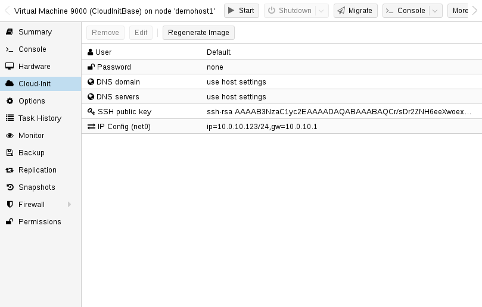

# Build a Kubernetes cluster using k3s via Ansible and Terraform

Author: <https://github.com/itwars> and <https://github.com/NatiSayada>

This is based on the great work that <https://github.com/itwars> done with ansible, all i left to do is to put it all togather with terraform and Proxmox!

## System requirements

Deployment environment must have Ansible 2.4.0+
Terraform installed
Proxmox server

## Usage

### proxmox setup

This setup is relayig on cloud-init image and its save a lot of the image configuration.
I use ubuntu focal image, to configure the cloud-init image you will need to connect to a linux server and run the following:

install image tools on the server (you will need another server, this tools cannot be installed on proxmox)

```bash
apt-get install libguestfs-tools
```

Get the image that you would like to work with.
you can browse to <https://cloud-images.ubuntu.com> and select any other version that you wold like to work with.
it can also work for debian and centos (R.I.P)

```bash
wget https://cloud-images.ubuntu.com/focal/current/focal-server-cloudimg-amd64.img
```

update the image and install proxmox agent - this is a must if we want terrafom to work properly.
it can take a minute to add the packege to the image.

```bash
virt-customize focal-server-cloudimg-amd64.img --install qemu-guest-agent
```

now that we have the image, we need to move it to the proxmox server.
we can do that by using `scp`

```bash
scp focal-server-cloudimg-amd64.img proxmox_username@proxmox_host:/path_on_proxmox/focal-server-cloudimg-amd64.img
```

so now we should have the image configured and on our proxmox server. lets start creating the VM

```bash
qm create 9000 --name "ubuntu-focal-cloudinit-template" --memory 2048 --net0 virtio,bridge=vmbr0
```

for ubuntu images, rename the image suffix

```bash
mv focal-server-cloudimg-amd64.img focal-server-cloudimg-amd64.qcow2
```

import the disk to the VM

```bash
qm importdisk 9000 focal-server-cloudimg-amd64.qcow2 local-lvm
```

configure the VM to use the new image

```bash
qm set 9000 --scsihw virtio-scsi-pci --scsi0 local-lvm:vm-9000-disk-0
```

add cloud init image to the VM

```bash
qm set 9000 --ide2 local-lvm:cloudinit
```

set the VM to boot from the cloud init disk:

```bash
qm set 9000 --boot c --bootdisk scsi0
```

update the serial on the VM

```bash
qm set 9000 --serial0 socket --vga serial0
```

Good! so we are almost done with the image. now we can configure are base configuration for the image.
you can connecto to the proxmox server and go to your VM and look on the cloudinit tab, here you will find some more parameters that we will nedd to change. 



you will need to change the user name, password, and add the ssh public key so we can connect to the vm later using ansible and terraform.
update the variables and click on `Regenerate Image`

Great! so now we can conver the VM to template and start working with terraform.

```bash
qm template 9000
```

### terraform setup

Rename the file `terraform/vars.sample` to `terraform/vars.tf` and update all the vars.
there you can select how many nodes wold you like to have on your cluster and configure the name of the base image.
to run the terrafom, you will need to cd into `terraform` and run:

```bash
terraform init
terraform plan
terraform apply
```

it can take some time to create the servers on proxmox but you can monitor them over proxmox.

### ansible setup

First create a new directory based on the `sample` directory within the `inventory` directory:

```bash
cp -R inventory/sample inventory/my-cluster
```

Second, edit `inventory/my-cluster/hosts.ini` to match the system information gathered above. For example:

```bash
[master]
192.16.35.12

[node]
192.16.35.[10:11]

[k3s_cluster:children]
master
node
```

If needed, you can also edit `inventory/my-cluster/group_vars/all.yml` to match your environment.

Start provisioning of the cluster using the following command:

```bash
ansible-playbook site.yml -i inventory/my-cluster/hosts.ini
```

## Kubeconfig

To get access to your **Kubernetes** cluster just

```bash
scp debian@master_ip:~/.kube/config ~/.kube/config
```
